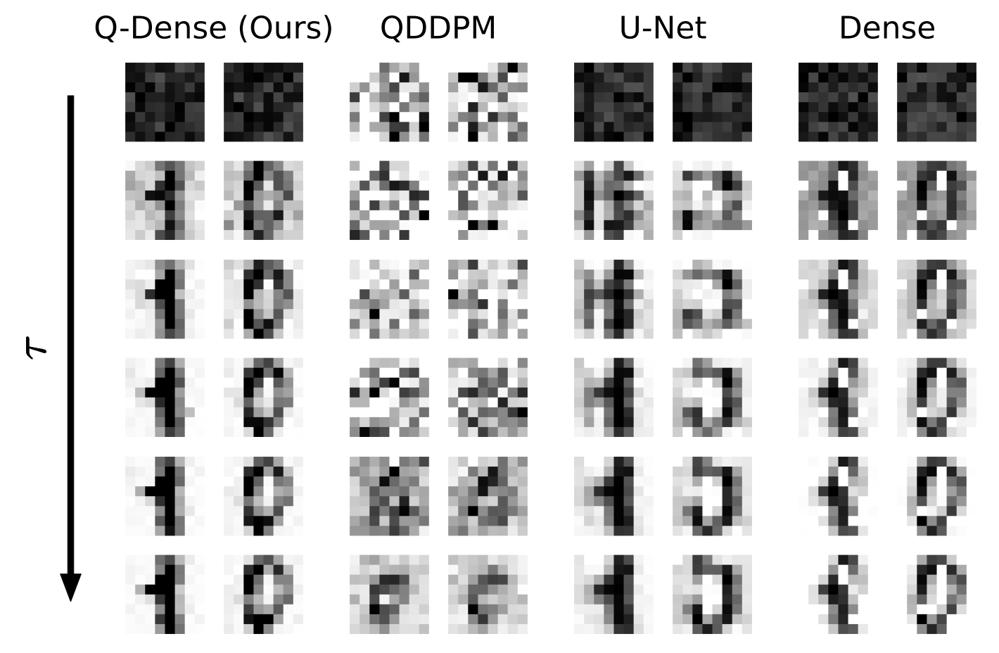

# Quantum Denoising Diffusion Models

Install the requirements: `pip install -r requirements.txt` (preferably in a virtual environment).

- Run `python main.py --help` to see all the options.
- Run `python main.py` to train and evaluate a `Q-Dense` model on the MNIST 8x8 dataset.

requiremnets_mac.txt is an altered version of requirements to run on mac (not suggested since it takes 10+ hours)

qddm_run.sh is a file to run the code on the HPC

HPC instructions:
1. upload code files to HPC:
   - rsync -avh --progress "<file location on local computer>" \
<slunet ID>2@login.libra.slu.edu:/home/<slunet ID>/...

2. Create a virtual env:
   - load module anaconda
   - conda create -n qddm python=3.10 -y
   - conda activate qddm
   - cd to quantum-diffusion-main root
   - pip install -r requirements.txt